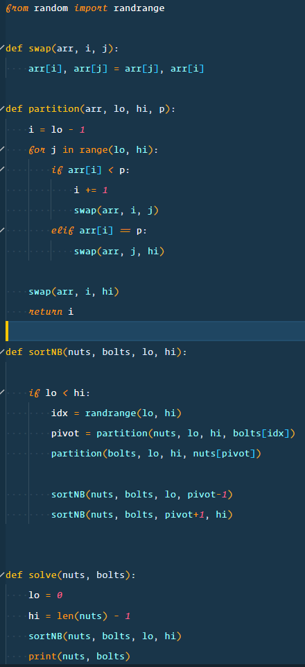
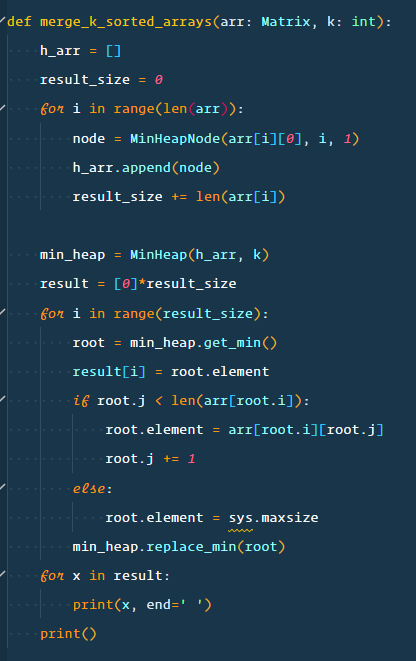
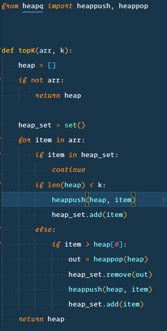

# Algorithms

Software Engineering Knowledge Bank + coding interview preparation.

## Table of Contents

- [Software Engineer Knowledge bank](#software-engineer-knowledge-bank)
  - [Table of Contents](#table-of-contents)
  - [Plan (update as we go)](#plan-update-as-we-go)
  - [Processes](#processes)
    - [study](#study)
    - [practice](#practice)

## Plan (update as we go)

1. Sorting
   1. study
      1. quickSort
         1. 
      2. mergeSort
         1. 
      3. heapSort
         1. 
   2. practice
      1. q1: nutsAndBolts
         1. 
      2. q2: mergeKSortedArrays
         1. 
      3. q3: topK
         1. 
      4. q4: 3sum
         1.
2. Recursion
3. Trees
4. ...
5. ...
6. ...

## Processes

### study

| time | task             |
| ---: | ---------------- |
|   10 | get + understand |
|   10 | discuss-1        |
|   10 | discuss-2        |

### practice

| time | task    |
| ---: | ------- |
|   15 | try     |
|  ... | discuss |
|  ... | ...     |
